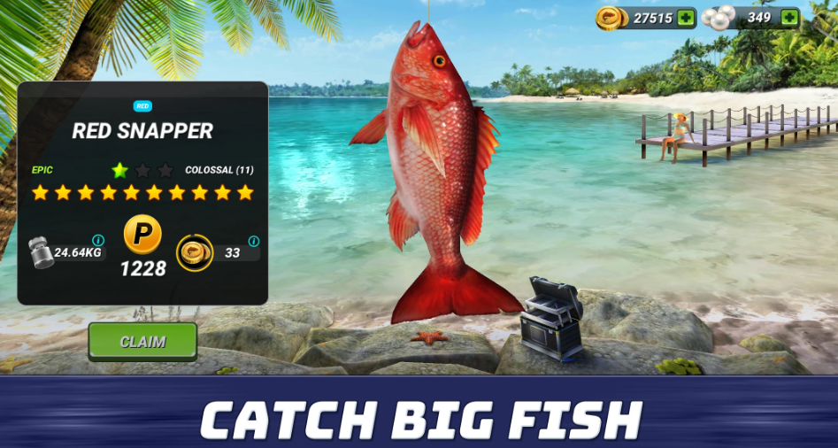
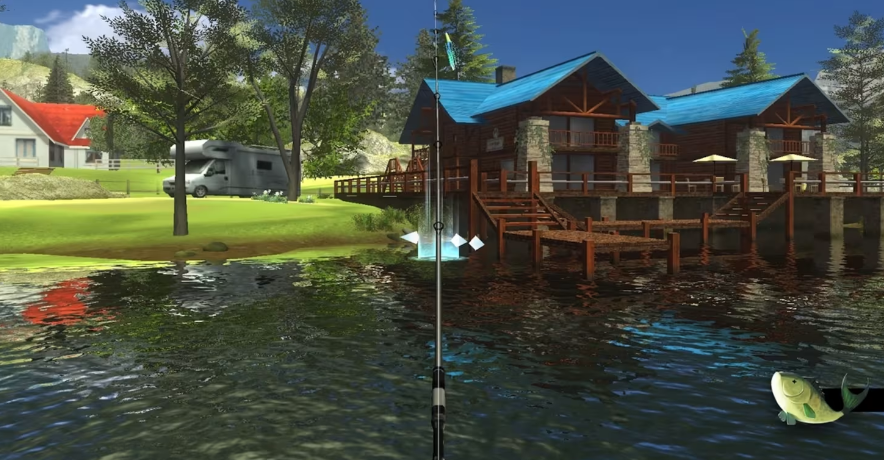
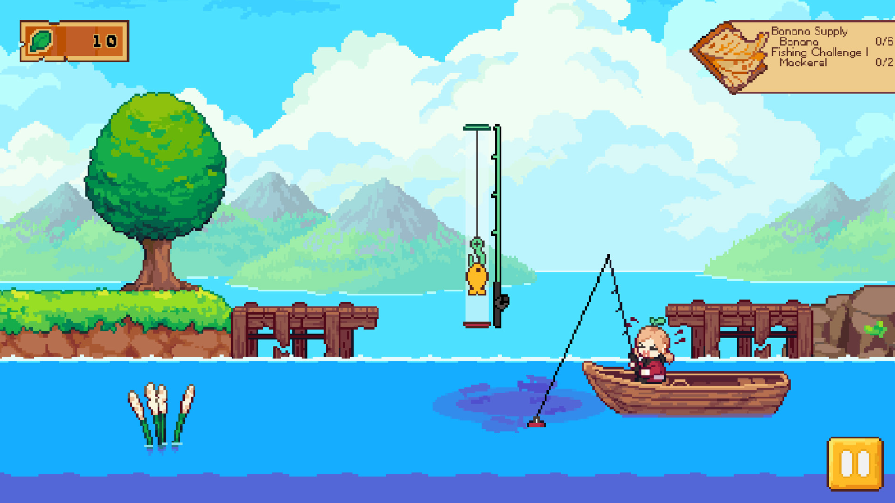

# PixelShores
An open world pixel style relaxing fishing game.

### Premise 
___
In this open world PC game the player will go around the world map in his car andp colled different secies of fish. He can sell them to earn money to upgrade his tools and vehicle. The objective is to collect all the rare types of fish in the game after visiting every location.
___
### Players
This single player game is made for people who want to enter another world and relax for some time. 
___
### Objectives 
The main objective is to collect all the different types of fish while traveling the world and enjoying the map.
___
### Processes
The player will start the game near a pound with some story dialogue that will be added later. The graphics and music, the vibe of the game, will be eye catching so the player wont quit.

The game loop will be pretty simple, visit a new location - catch fish & get money and leave. Ofcourse the game is open world so the player can travel the world at any time.

After catching all the fish the player will 'win' the game, but he will be able to contiue playing if he wants to.

#### Controls
| Action | Keybind |
| - | - |
| Move Up | W |
| Move Left | A |
| Move Right | D |
| Move Down | S |
| Interact | E |
| Open Map | M |
| Open Inventory | I |
| Open Collcection | O |
| Catch Fish | Mouse Left |
___
### Rules
The player will encounter because its supposed to be a relaxing game. The main limits will be:
- The car fuel that can end - making the player walk on foot to get fuel. 
- The fish bait can end - making the player go buy/catch more.
- The RNG - can make the player not catch the desired fish.

The best way to learn is by doing - so they player will learn the rules the hard way. non of them are too punishing but the game will teach the player only after he messes up.

The main rule that has an affect on the ending of the game is the RNG aspect which can make the player stuck for some time.
___
### Resources
The resources will be:
- Cash - allows the player to buy new equipment, earned by selling fish in stores. 
- Fuel - Allows the car to be driven, can be bought in stores on the map.
- Bait - Allows the player to fish, can be bought or caught in the wild.

The player will be able to check his inventory to see how much cash & bait he has left. And a car HUD will appear apon entering it, showing how much fuel is left.

The shop prices will decide how easy the game is, so easy to catch fish will be worth much less, making the game not too easy.
___
### Encounters
The game is completly open world and the story is made by the player, so each ecounter is his own doing (getting stuck without fuel and such).
___
### Confines
As stated, the game will be 2D, open world and top down, the player will be allowed to explore freely. The map will be a custom made by hand and not randomly generated to make it less empty and souless.

To make navigation and traveling easy and more fun the game will include a map with important places marked on it. The player will have a car that will allow him to travel faster from place to place.

And he will have to travel because certain fish will spawn in specific areas of the map.
___
### Ending
The game will have 1 ending but two options:
1. The player will catch all the fish and complete the game.
2. The player will choose to continue playing for a relaxing experience.

How fast the player finishes the game will be based on luck - if the desired fish are spawned or not.
___
### Market survey
After searching for "Fishing game" i got the following result:

## [Fishing Clash: Sport Simulator](https://play.google.com/store/apps/details?id=com.tensquaregames.letsfish2)

This game seem to lack the open world aspect i'll add, making it more interactive so more players want to play it.

## [Legendary Fishing](https://www.nintendo.com/us/store/products/legendary-fishing-switch/)

This games graphic seem to be less styled, this is why in my game i will use pixel art to add some nice visualas and make the game more apealing. It also suffers from the same issue as the first one.

## [Luna's Fishing Garden](https://store.steampowered.com/app/1477790/Lunas_Fishing_Garden/)

This game is the most similar one, with great art direction and some traveing around the map, but it doesnt have the collection aspect and the player is confined to the boat. In my game the play can move freely and many players enjoy to collect game loot.